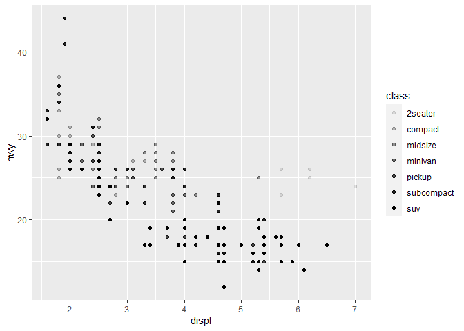
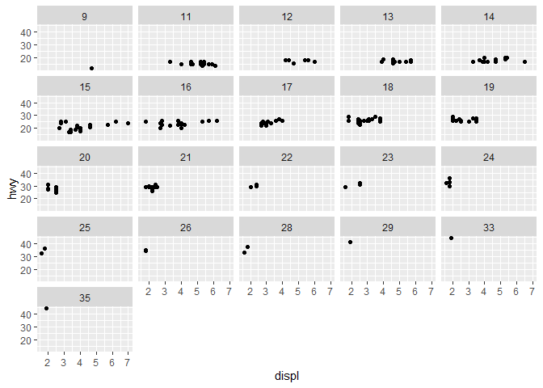
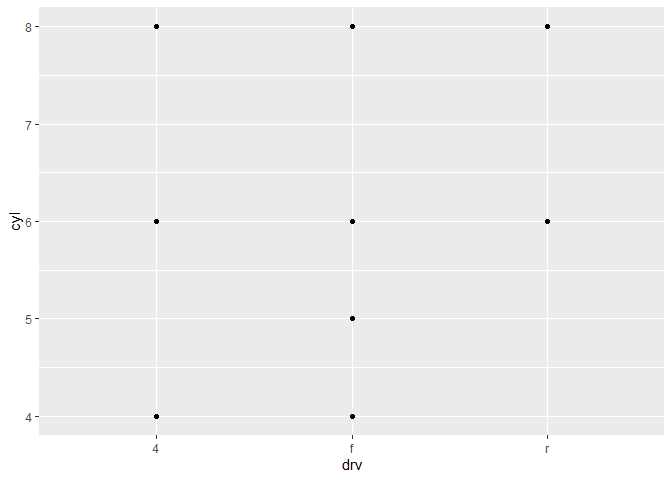

Chapter 3 - Data Visualization
================
Brett Whitney
Jan 8, 2021

### Introduction to Explore Section

Data exploration means looking at data, quickly generate
questions/hypotheses, test them, and repeat. We want to generate many
promising avenues for in-depth investigation.

``` r
library(tidyverse)
```

    ## -- Attaching packages --------------------------------------- tidyverse 1.3.0 --

    ## v ggplot2 3.3.3     v purrr   0.3.4
    ## v tibble  3.0.4     v dplyr   1.0.2
    ## v tidyr   1.1.2     v stringr 1.4.0
    ## v readr   1.4.0     v forcats 0.5.0

    ## -- Conflicts ------------------------------------------ tidyverse_conflicts() --
    ## x dplyr::filter() masks stats::filter()
    ## x dplyr::lag()    masks stats::lag()

### 3.2 First steps

Do cars with big engines use more fuel than cars with small engines?
Definitely a positive correlation between these two, I’m gonna guess the
relationship is also fairly linear.

``` r
ggplot(data = mpg) +
  geom_point(mapping = aes(x = displ, y = hwy))
```

<!-- -->

Plot shows as engine size increases, the mpg of the car decreases,
confirming that there is a positive relationship between a car’s engine
size and how much fuel it uses.

`ggplot()` creates an empty plot to which we add layers using functions
like `geom_point()`. Each geom function takes a `mapping` parameter
which maps variables to visual properties, like the x and y axis of a
scatterplot.

#### 3.2 Exercises

1.  Run `ggplot(data = mpg)`. What do you see?

<!-- end list -->

``` r
ggplot(data = mpg)
```

<!-- -->

Running this code yields a light gray box with just a touch of white
padding around the edges.

2.  How many rows are in `mpg`? How many columns?

<!-- end list -->

``` r
nrow(mpg)
```

    ## [1] 234

``` r
ncol(mpg)
```

    ## [1] 11

234 rows and 11 columns.

3.  What does the `drv` variable describe? Read the help for `?mpg` to
    find out.

<!-- end list -->

``` r
?mpg
```

    ## starting httpd help server ... done

`drv` describes if the vehicle is front, rear, or four wheel drive.

4.  Make a scatterplot of `hwy` vs `cyl`.

<!-- end list -->

``` r
ggplot(data = mpg) +
  geom_point(mapping = aes(x = hwy, y = cyl))
```

<!-- -->

5.  What happens if you make a scatterplot of `class` vs `drv`? Why is
    the plot not useful?

<!-- end list -->

``` r
ggplot(data = mpg) +
  geom_point(mapping = aes(x = class, y = drv))
```

<!-- -->

This plot isn’t useful because neither variable is continuous/numeric,
they are both categorical.

### 3.3 Aesthetic Mappings

An aesthetic is a visual property or element of the stuff in a plot.
Value -\> describe data; Level -\> describe an aesthetics’s settings

``` r
ggplot(data = mpg) +
  geom_point(mapping = aes(x = displ, y = hwy, color = class))
```

<!-- -->

When you map a variable name like `class` to an aesthetic like `color`
ggplot will assign a unique level of the aesthetic to each value of the
variable. This is called scaling in ggplot2 parlance.

ggplot won’t stop you from doing things that aren’t great ideas, but it
might warn you\!

Mapping `size` to a discrete/categorical variable like `class` doesn’t
make for interpretable charts.

``` r
ggplot(data = mpg) +
  geom_point(mapping = aes(x = displ, y = hwy, size = class))
```

    ## Warning: Using size for a discrete variable is not advised.

<!-- -->

Some more less than useful aesthetic mappings for `class`:

``` r
ggplot(data = mpg) +
  geom_point(mapping = aes(x = displ, y = hwy, alpha = class))
```

    ## Warning: Using alpha for a discrete variable is not advised.

<!-- -->

``` r
ggplot(data = mpg) +
  geom_point(mapping = aes(x = displ, y = hwy, shape = class))
```

    ## Warning: The shape palette can deal with a maximum of 6 discrete values because
    ## more than 6 becomes difficult to discriminate; you have 7. Consider
    ## specifying shapes manually if you must have them.

    ## Warning: Removed 62 rows containing missing values (geom_point).

<!-- -->

Important note\! Don’t use `shape` with more than 6 levels, because
ggplot2 sure won’t.

`x` and `y` are themselves aesthetics.

Aesthetics can be set at particular levels, like making all the points
in a scatterplot blue.

``` r
ggplot(data = mpg) +
  geom_point(mapping = aes(x = displ, y = hwy), color = "blue")
```

<!-- -->

Notice that the color aesthetic is no longer passed to `aes()` in this
use case, because it isn’t associated with a variable anymore.

#### 3.3 Exercises

1.  What’s gone wrong with this code? Why are the points not blue?

<!-- end list -->

``` r
ggplot(data = mpg) + 
  geom_point(mapping = aes(x = displ, y = hwy, color = "blue"))
```

<!-- -->

This plot doesn’t work out because the `color` argument has been set
within `aes()`. I would gather that ggplot then took “blue” as a
nameless variable where all values equaled “blue” so it assigned a
color, in this case red, to every row where the value of this nameless
variable was “blue”.

2.  Which variables in `mpg` are categorical? Which variables are
    continuous? (Hint: type `?mpg` to read the documentation for the
    dataset). How can you see this information when you run `mpg`?

Categorical: `manufacturer`, `model`, `trans`, `drv`, `fl`, `class`
Continuous: `displ`, `cty`, `hwy`, `cyl` (maybe) I can see arguments for
both: `year`

If you run `mpg` you will see the first ten rows and columns of the
tibble, and it prints the column type below each column name.

3.  Map a continuous variable to color, size, and shape. How do these
    aesthetics behave differently for categorical vs. continuous
    variables?

<!-- end list -->

``` r
ggplot(data = mpg) +
  geom_point(mapping = aes(x = displ, y = hwy, color = cty))
```

<!-- -->

Instead of assigning a level to each unique value of `cty`, `color`
assigned each value to a range of blues where darker blues have lower
values of `cty`.

``` r
ggplot(data = mpg) +
  geom_point(mapping = aes(x = displ, y = hwy, size = cty))
```

<!-- -->

Smaller values of `cty` are mapped to smaller shapes.

``` r
#ggplot(data = mpg) +
#  geom_point(mapping = aes(x = displ, y = hwy, shape = cty))
```

This results in an error and no plot, since it would be madness to
assign a different shape to each unique value of `cty`.

4.  What happens if you map the same variable to multiple aesthetics?

<!-- end list -->

``` r
ggplot(data = mpg) +
  geom_point(mapping = aes(x = displ, y = hwy, color = cty, size = cty))
```

<!-- -->

This works just fine, creating a legend for each aesthetic. In practice,
perhaps a bit redundant, but I could see a scenario where one **really**
wants to draw attention to a certain feature of the data.

5.  What does the `stroke` aesthetic do? What shapes does it work with?
    (Hint: use `?geom_point`)

`stroke` modifies the width of a shape’s border, so it only works with
shapes that have a border.

6.  What happens if you map an aesthetic to something other than a
    variable name, like `aes(colour = displ < 5)`? Note, you’ll also
    need to specify `x` and `y`.

<!-- end list -->

``` r
ggplot(data = mpg) +
  geom_point(mapping = aes(x = displ, y = hwy, color = displ < 5))
```

<!-- -->

Ohoho, this acts as a shorthand way to identify points in the data where
a condition is true or false, me likey.

### 3.4 Common problems

**No matter how much practice I get writing code, every day I will
continue to write code that doesn’t work.**

Google is your friend.

### 3.5 Facets

Facets are a good way to include additional variables to a plot,
especially categorical variables.

`facet_wrap()` for faceting by one discrete variable

``` r
ggplot(data = mpg) + 
  geom_point(mapping = aes(x = displ, y = hwy)) + 
  facet_wrap(~ class, nrow = 2)
```

<!-- -->

`facet_grid()` for faceting by two variables

``` r
ggplot(data = mpg) + 
  geom_point(mapping = aes(x = displ, y = hwy)) + 
  facet_grid(drv ~ cyl)
```

<!-- -->

replacing one of the variables in `facet_grid()` will only facet in rows
or columns, depending on which side of the formula your remaining
variable is.

``` r
ggplot(data = mpg) + 
  geom_point(mapping = aes(x = displ, y = hwy)) + 
  facet_grid(. ~ cyl)
```

<!-- -->

#### 3.5 Exercises

1.  What happens if you facet on a continuous variable?

<!-- end list -->

``` r
ggplot(data = mpg) +
  geom_point(mapping = aes(x = displ, y = hwy)) +
  facet_wrap(~ cty)
```

<!-- -->

ggplot makes a valiant effort to make plots for each value of your
faceted variable, but you end up with too many plots and not enough data
in many of them to see anything.

2.What do the empty cells in plot with facet\_grid(drv \~ cyl) mean? How
do they relate to this plot?

``` r
ggplot(data = mpg) + 
  geom_point(mapping = aes(x = drv, y = cyl))
```

<!-- -->

They correspond to combinations of `drv` and `cyl` with no data to show.
In relation to the above plot, they represent the intersections of `x`
and `y` with no point plotted in the chart. 3.What plots does the
following code make? What does `.` do?

``` r
ggplot(data = mpg) + 
  geom_point(mapping = aes(x = displ, y = hwy)) +
  facet_grid(drv ~ .)
```

<!-- -->

``` r
ggplot(data = mpg) + 
  geom_point(mapping = aes(x = displ, y = hwy)) +
  facet_grid(. ~ cyl)
```

<!-- -->

The first makes 3 plots in 1 column where each row corresponds to a
value of `drv`. The second makes 4 plots in 1 row where each column
corresponds to a value of `cyl`. So, `.` causes a faceted plot with only
1 variable, but in 1 row or 1 column rather than several columns/rows
like `facet_wrap()`. 4.Take the first faceted plot in this section:

``` r
ggplot(data = mpg) + 
  geom_point(mapping = aes(x = displ, y = hwy)) + 
  facet_wrap(~ class, nrow = 2)
```

<!-- -->

What are the advantages to using faceting instead of the color
aesthetic? What are the disadvantages? How might the balance change if
you had a larger dataset?

Faceting over color makes it a little easier to interrogate subsets of
data, especially when there are more than a handful of levels to the
categorical variable you use to facet.

5.Read `?facet_wrap`. What does `nrow` do? What does `ncol` do? What
other options control the layout of the individual panels? Why doesn’t
`facet_grid()` have `nrow` and `ncol` arguments?

`nrow` and `ncol` control the number of rows or columns that ggplot will
generate faceted plots into. `facet_grid()` doesn’t have this because it
gets those values from the variables you use to facet. Other options for
controlling the layout include `as.table`, `drop`, `switch`, and `drop`.

6.  When using `facet_grid()` you should usually put the variable with
    more unique levels in the columns. Why?

I’m not satisfied with this answer, but I suppose it makes the overall
appearance of the plots more square, which is more pleasing to the eye.
I’d wager it also puts empty facets at the bottom-right which is handy
since we read left to right, top to bottom.
