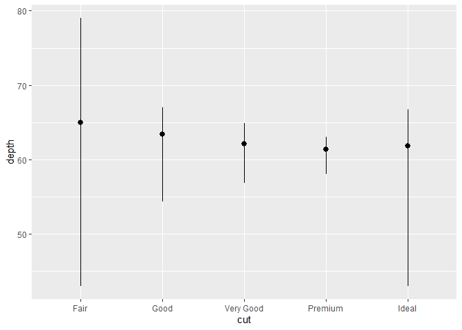
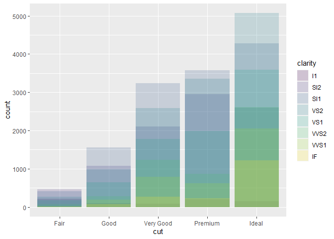
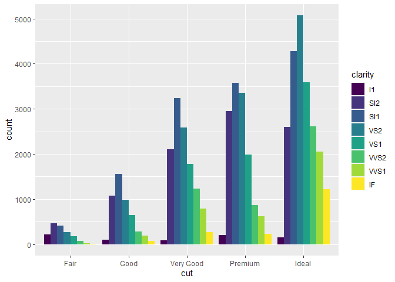
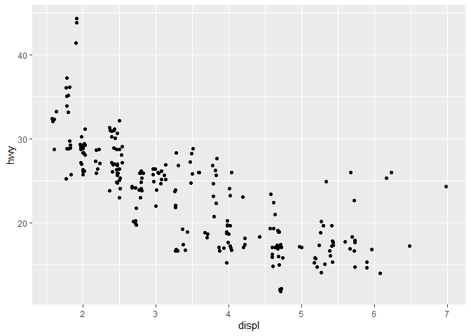
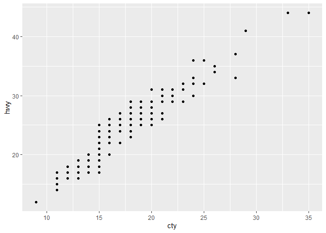

Chapter 3 - Data Visualization
================
Brett Whitney
Jan 8, 2021

### Introduction to Explore Section

Data exploration means looking at data, quickly generate
questions/hypotheses, test them, and repeat. We want to generate many
promising avenues for in-depth investigation.

``` r
library(tidyverse)
```

    ## -- Attaching packages --------------------------------------- tidyverse 1.3.0 --

    ## v ggplot2 3.3.3     v purrr   0.3.4
    ## v tibble  3.0.4     v dplyr   1.0.2
    ## v tidyr   1.1.2     v stringr 1.4.0
    ## v readr   1.4.0     v forcats 0.5.0

    ## -- Conflicts ------------------------------------------ tidyverse_conflicts() --
    ## x dplyr::filter() masks stats::filter()
    ## x dplyr::lag()    masks stats::lag()

### 3.2 First steps

Do cars with big engines use more fuel than cars with small engines?
Definitely a positive correlation between these two, I’m gonna guess the
relationship is also fairly linear.

``` r
ggplot(data = mpg) +
  geom_point(mapping = aes(x = displ, y = hwy))
```

<!-- -->

Plot shows as engine size increases, the mpg of the car decreases,
confirming that there is a positive relationship between a car’s engine
size and how much fuel it uses.

`ggplot()` creates an empty plot to which we add layers using functions
like `geom_point()`. Each geom function takes a `mapping` parameter
which maps variables to visual properties, like the x and y axis of a
scatterplot.

#### 3.2 Exercises

1.  Run `ggplot(data = mpg)`. What do you see?

<!-- end list -->

``` r
ggplot(data = mpg)
```

<!-- -->

Running this code yields a light gray box with just a touch of white
padding around the edges.

2.  How many rows are in `mpg`? How many columns?

<!-- end list -->

``` r
nrow(mpg)
```

    ## [1] 234

``` r
ncol(mpg)
```

    ## [1] 11

234 rows and 11 columns.

3.  What does the `drv` variable describe? Read the help for `?mpg` to
    find out.

<!-- end list -->

``` r
?mpg
```

    ## starting httpd help server ... done

`drv` describes if the vehicle is front, rear, or four wheel drive.

4.  Make a scatterplot of `hwy` vs `cyl`.

<!-- end list -->

``` r
ggplot(data = mpg) +
  geom_point(mapping = aes(x = hwy, y = cyl))
```

<!-- -->

5.  What happens if you make a scatterplot of `class` vs `drv`? Why is
    the plot not useful?

<!-- end list -->

``` r
ggplot(data = mpg) +
  geom_point(mapping = aes(x = class, y = drv))
```

<!-- -->

This plot isn’t useful because neither variable is continuous/numeric,
they are both categorical.

### 3.3 Aesthetic Mappings

An aesthetic is a visual property or element of the stuff in a plot.
Value -\> describe data; Level -\> describe an aesthetics’s settings

``` r
ggplot(data = mpg) +
  geom_point(mapping = aes(x = displ, y = hwy, color = class))
```

<!-- -->

When you map a variable name like `class` to an aesthetic like `color`
ggplot will assign a unique level of the aesthetic to each value of the
variable. This is called scaling in ggplot2 parlance.

ggplot won’t stop you from doing things that aren’t great ideas, but it
might warn you\!

Mapping `size` to a discrete/categorical variable like `class` doesn’t
make for interpretable charts.

``` r
ggplot(data = mpg) +
  geom_point(mapping = aes(x = displ, y = hwy, size = class))
```

    ## Warning: Using size for a discrete variable is not advised.

<!-- -->

Some more less than useful aesthetic mappings for `class`:

``` r
ggplot(data = mpg) +
  geom_point(mapping = aes(x = displ, y = hwy, alpha = class))
```

    ## Warning: Using alpha for a discrete variable is not advised.

<!-- -->

``` r
ggplot(data = mpg) +
  geom_point(mapping = aes(x = displ, y = hwy, shape = class))
```

    ## Warning: The shape palette can deal with a maximum of 6 discrete values because
    ## more than 6 becomes difficult to discriminate; you have 7. Consider
    ## specifying shapes manually if you must have them.

    ## Warning: Removed 62 rows containing missing values (geom_point).

<!-- -->

Important note\! Don’t use `shape` with more than 6 levels, because
ggplot2 sure won’t.

`x` and `y` are themselves aesthetics.

Aesthetics can be set at particular levels, like making all the points
in a scatterplot blue.

``` r
ggplot(data = mpg) +
  geom_point(mapping = aes(x = displ, y = hwy), color = "blue")
```

<!-- -->

Notice that the color aesthetic is no longer passed to `aes()` in this
use case, because it isn’t associated with a variable anymore.

#### 3.3 Exercises

1.  What’s gone wrong with this code? Why are the points not blue?

<!-- end list -->

``` r
ggplot(data = mpg) + 
  geom_point(mapping = aes(x = displ, y = hwy, color = "blue"))
```

<!-- -->

This plot doesn’t work out because the `color` argument has been set
within `aes()`. I would gather that ggplot then took “blue” as a
nameless variable where all values equaled “blue” so it assigned a
color, in this case red, to every row where the value of this nameless
variable was “blue”.

2.  Which variables in `mpg` are categorical? Which variables are
    continuous? (Hint: type `?mpg` to read the documentation for the
    dataset). How can you see this information when you run `mpg`?

Categorical: `manufacturer`, `model`, `trans`, `drv`, `fl`, `class`
Continuous: `displ`, `cty`, `hwy`, `cyl` (maybe) I can see arguments for
both: `year`

If you run `mpg` you will see the first ten rows and columns of the
tibble, and it prints the column type below each column name.

3.  Map a continuous variable to color, size, and shape. How do these
    aesthetics behave differently for categorical vs. continuous
    variables?

<!-- end list -->

``` r
ggplot(data = mpg) +
  geom_point(mapping = aes(x = displ, y = hwy, color = cty))
```

<!-- -->

Instead of assigning a level to each unique value of `cty`, `color`
assigned each value to a range of blues where darker blues have lower
values of `cty`.

``` r
ggplot(data = mpg) +
  geom_point(mapping = aes(x = displ, y = hwy, size = cty))
```

<!-- -->

Smaller values of `cty` are mapped to smaller shapes.

``` r
#ggplot(data = mpg) +
#  geom_point(mapping = aes(x = displ, y = hwy, shape = cty))
```

This results in an error and no plot, since it would be madness to
assign a different shape to each unique value of `cty`.

4.  What happens if you map the same variable to multiple aesthetics?

<!-- end list -->

``` r
ggplot(data = mpg) +
  geom_point(mapping = aes(x = displ, y = hwy, color = cty, size = cty))
```

<!-- -->

This works just fine, creating a legend for each aesthetic. In practice,
perhaps a bit redundant, but I could see a scenario where one **really**
wants to draw attention to a certain feature of the data.

5.  What does the `stroke` aesthetic do? What shapes does it work with?
    (Hint: use `?geom_point`)

`stroke` modifies the width of a shape’s border, so it only works with
shapes that have a border.

6.  What happens if you map an aesthetic to something other than a
    variable name, like `aes(colour = displ < 5)`? Note, you’ll also
    need to specify `x` and `y`.

<!-- end list -->

``` r
ggplot(data = mpg) +
  geom_point(mapping = aes(x = displ, y = hwy, color = displ < 5))
```

<!-- -->

Ohoho, this acts as a shorthand way to identify points in the data where
a condition is true or false, me likey.

### 3.4 Common problems

**No matter how much practice I get writing code, every day I will
continue to write code that doesn’t work.**

Google is your friend.

### 3.5 Facets

Facets are a good way to include additional variables to a plot,
especially categorical variables.

`facet_wrap()` for faceting by one discrete variable

``` r
ggplot(data = mpg) + 
  geom_point(mapping = aes(x = displ, y = hwy)) + 
  facet_wrap(~ class, nrow = 2)
```

<!-- -->

`facet_grid()` for faceting by two variables

``` r
ggplot(data = mpg) + 
  geom_point(mapping = aes(x = displ, y = hwy)) + 
  facet_grid(drv ~ cyl)
```

<!-- -->

replacing one of the variables in `facet_grid()` will only facet in rows
or columns, depending on which side of the formula your remaining
variable is.

``` r
ggplot(data = mpg) + 
  geom_point(mapping = aes(x = displ, y = hwy)) + 
  facet_grid(. ~ cyl)
```

<!-- -->

#### 3.5 Exercises

1.  What happens if you facet on a continuous variable?

<!-- end list -->

``` r
ggplot(data = mpg) +
  geom_point(mapping = aes(x = displ, y = hwy)) +
  facet_wrap(~ cty)
```

<!-- -->

ggplot makes a valiant effort to make plots for each value of your
faceted variable, but you end up with too many plots and not enough data
in many of them to see anything.

2.What do the empty cells in plot with facet\_grid(drv \~ cyl) mean? How
do they relate to this plot?

``` r
ggplot(data = mpg) + 
  geom_point(mapping = aes(x = drv, y = cyl))
```

<!-- -->

They correspond to combinations of `drv` and `cyl` with no data to show.
In relation to the above plot, they represent the intersections of `x`
and `y` with no point plotted in the chart. 3.What plots does the
following code make? What does `.` do?

``` r
ggplot(data = mpg) + 
  geom_point(mapping = aes(x = displ, y = hwy)) +
  facet_grid(drv ~ .)
```

<!-- -->

``` r
ggplot(data = mpg) + 
  geom_point(mapping = aes(x = displ, y = hwy)) +
  facet_grid(. ~ cyl)
```

<!-- -->

The first makes 3 plots in 1 column where each row corresponds to a
value of `drv`. The second makes 4 plots in 1 row where each column
corresponds to a value of `cyl`. So, `.` causes a faceted plot with only
1 variable, but in 1 row or 1 column rather than several columns/rows
like `facet_wrap()`. 4.Take the first faceted plot in this section:

``` r
ggplot(data = mpg) + 
  geom_point(mapping = aes(x = displ, y = hwy)) + 
  facet_wrap(~ class, nrow = 2)
```

<!-- -->

What are the advantages to using faceting instead of the color
aesthetic? What are the disadvantages? How might the balance change if
you had a larger dataset?

Faceting over color makes it a little easier to interrogate subsets of
data, especially when there are more than a handful of levels to the
categorical variable you use to facet.

5.Read `?facet_wrap`. What does `nrow` do? What does `ncol` do? What
other options control the layout of the individual panels? Why doesn’t
`facet_grid()` have `nrow` and `ncol` arguments?

`nrow` and `ncol` control the number of rows or columns that ggplot will
generate faceted plots into. `facet_grid()` doesn’t have this because it
gets those values from the variables you use to facet. Other options for
controlling the layout include `as.table`, `drop`, `switch`, and `drop`.

6.  When using `facet_grid()` you should usually put the variable with
    more unique levels in the columns. Why?

I’m not satisfied with this answer, but I suppose it makes the overall
appearance of the plots more square, which is more pleasing to the eye.
I’d wager it also puts empty facets at the bottom-right which is handy
since we read left to right, top to bottom.

### 3.6 Geometric Objects

The different visual objects available to display data are called geoms.

Could map a variable to aesthetics like `linetype` in `geom_smooth()` to
assign different levels of that aesthetic to different values of the
variable.

You can add as many different geoms as you’d like to one plot. Visit
[here](https://exts.ggplot2.tidyverse.org/gallery/) for a gallery of
geoms in different packages.

For geoms like `geom_smooth()` that use a single visual object to
represent several rows of data you can use the `group` aesthetic to
create several objects. `group` does not add a legend or distinguishing
features to the different objects it draws.

``` r
ggplot(data = mpg) +
  geom_smooth(mapping = aes(x = displ, y = hwy))
```

    ## `geom_smooth()` using method = 'loess' and formula 'y ~ x'

<!-- -->

``` r
ggplot(data = mpg) +
  geom_smooth(mapping = aes(x = displ, y = hwy, group = drv))
```

    ## `geom_smooth()` using method = 'loess' and formula 'y ~ x'

<!-- -->

``` r
ggplot(data = mpg) +
  geom_smooth(
    mapping = aes(x = displ, y = hwy, color = drv),
    show.legend = FALSE
  )
```

    ## `geom_smooth()` using method = 'loess' and formula 'y ~ x'

<!-- -->

Adding different geoms to a single plot is as easy as…literally adding
them with `+`.

``` r
ggplot(data = mpg) + 
  geom_point(mapping = aes(x = displ, y = hwy)) +
  geom_smooth(mapping = aes(x = displ, y = hwy))
```

    ## `geom_smooth()` using method = 'loess' and formula 'y ~ x'

<!-- -->

And now our code is no longer DRY, so instead we can set a ‘default’
global mapping for each geom by declaring it with `aes()` inside the
initial call to `ggplot()`.

``` r
ggplot(data = mpg, mapping = aes(x = displ, y = hwy)) + 
  geom_point() + 
  geom_smooth()
```

    ## `geom_smooth()` using method = 'loess' and formula 'y ~ x'

<!-- -->

Less repetitive code, same result.

Using an aesthetic mapping in a geom then they will apply to that layer
only. So if we want to modify the previous graph to color the points by
class, but keep a single trend line we can do:

``` r
ggplot(data = mpg, mapping = aes(x = displ, y = hwy)) + 
  geom_point(mapping = aes(color = class)) + 
  geom_smooth()
```

    ## `geom_smooth()` using method = 'loess' and formula 'y ~ x'

<!-- -->

This idea of local mappings extend to the data argument as well.
Different geoms in the same graph can use different data sets\!

``` r
ggplot(data = mpg, mapping = aes(x = displ, y = hwy)) + 
  geom_point(mapping = aes(color = class)) + 
  geom_smooth(data = filter(mpg, class == "subcompact"), se = FALSE)
```

    ## `geom_smooth()` using method = 'loess' and formula 'y ~ x'

<!-- -->

#### 3.6 Exercises

1.  What geom would you use to draw a line chart? A boxplot? A
    histogram? An area chart?

`geom_line()`, `geom_boxplot()`, `geom_histogram()`, `geom_area()`

2.Run this code in your head and predict what the output will look like.
Then, run the code in R and check your predictions.

Prediction: A scatterplot under several smoothed lines whose color
matches to `drv`. The points of the scatterplot would also be mapped to
a color by their `drv` value. There will be a legend, and not the gray
areas around the smoothed lines showing standard error of the estimated
line.

``` r
ggplot(data = mpg, mapping = aes(x = displ, y = hwy, color = drv)) + 
  geom_point() + 
  geom_smooth(se = FALSE)
```

    ## `geom_smooth()` using method = 'loess' and formula 'y ~ x'

<!-- -->

Nailed it.

3.  What does show.legend = FALSE do? What happens if you remove it? Why
    do you think I used it earlier in the chapter?

It prevents a legend for that layer from being generated. I’d assume it
was used because it was shown in context with 2 other charts that didn’t
have legends so removing it made the visual appearance of the charts
more visually pleasing and the legend couldn’t distract from the point
being made.

4.  What does the `se` argument to `geom_smooth()` do?

`se` controls if a confidence interval will be displayed around the
estimated line.

5.  Will these two graphs look different? Why/why not?

They will be the same, both have the same aesthetic mappings for each
layer, but the first takes advantage of the ability to declare a global
mapping in `ggplot()`.

``` r
ggplot(data = mpg, mapping = aes(x = displ, y = hwy)) + 
  geom_point() + 
  geom_smooth()
```

    ## `geom_smooth()` using method = 'loess' and formula 'y ~ x'

<!-- -->

``` r
ggplot() + 
  geom_point(data = mpg, mapping = aes(x = displ, y = hwy)) + 
  geom_smooth(data = mpg, mapping = aes(x = displ, y = hwy))
```

    ## `geom_smooth()` using method = 'loess' and formula 'y ~ x'

<!-- -->

6.  Recreate the R code necessary to generate the following graphs.

I went left to right, top to bottom:

``` r
ggplot(data = mpg, mapping = aes(x = displ, y = hwy)) +
  geom_point() +
  geom_smooth(color = 'blue', se = FALSE)
```

    ## `geom_smooth()` using method = 'loess' and formula 'y ~ x'

<!-- -->

``` r
ggplot(data = mpg, mapping = aes(x = displ, y = hwy)) +
  geom_point() +
  geom_smooth(mapping = aes(group = drv), color = "blue", se = FALSE)
```

    ## `geom_smooth()` using method = 'loess' and formula 'y ~ x'

<!-- -->

``` r
ggplot(data = mpg, mapping = aes(x = displ, y = hwy, color = drv)) +
  geom_point() +
  geom_smooth(se = FALSE)
```

    ## `geom_smooth()` using method = 'loess' and formula 'y ~ x'

<!-- -->

``` r
ggplot(data = mpg, mapping = aes(x = displ, y = hwy)) +
  geom_point(mapping = aes(color = drv)) +
  geom_smooth(color = "blue", se = FALSE)
```

    ## `geom_smooth()` using method = 'loess' and formula 'y ~ x'

<!-- -->

``` r
ggplot(data = mpg, mapping = aes(x = displ, y = hwy)) +
  geom_point(mapping = aes(color = drv)) +
  geom_smooth(mapping = aes(linetype = drv), color = "blue", se = FALSE)
```

    ## `geom_smooth()` using method = 'loess' and formula 'y ~ x'

<!-- -->

Had to look up the answer for this last one, my crappy eyes couldn’t
tell what was going on.

``` r
ggplot(data = mpg, mapping = aes(x = displ, y = hwy)) + 
  geom_point(size = 4, colour = "white") + 
  geom_point(aes(colour = drv))
```

<!-- -->

### 3.7 Statistical Transformations

Switching gears to the `diamonds` data set and `geom_bar()`.

``` r
ggplot(data = diamonds) + 
  geom_bar(mapping = aes(x = cut))
```

<!-- -->

So the thing to point out here is that the y-axis, `count` is not a
variable in the `diamonds` data set, nor did we supply it to
`geom_bar()` in the mapping. So where did it come from? While geoms like
`geom_point()` visualize the raw data, many geoms like `geom_bar()` will
actually calculate new values to be plotted. These new values include
stuff like counts, predictions from a model, summary statistics, etc.

In ggplot parlance, a **stat** is the mathematical calculation used to
generate these new values. The default value of the `stat` argument for
each geom tells you what transformation that geom performs to plot the
data. These correspond to a family of stat functions that can also be
used with `ggplot()`.

``` r
ggplot(data = diamonds) + 
  stat_count(mapping = aes(x = cut))
```

<!-- -->

Usually don’t need to worry about using a stat explicitly, but are three
reasons you might: 1. Change the default, for example when the dataset
already has a `count` variable and you need a bar chart.

``` r
demo <- tribble(
  ~cut,         ~freq,
  "Fair",       1610,
  "Good",       4906,
  "Very Good",  12082,
  "Premium",    13791,
  "Ideal",      21551
)

ggplot(data = demo) +
  geom_bar(mapping = aes(x = cut, y = freq), stat = "identity")
```

<!-- -->

2.  You want to change the default mapping between computed variables
    and their aesthetics. Creating a bar chart of proportions rather
    than counts for example.

<!-- end list -->

``` r
ggplot(data = diamonds) + 
  geom_bar(mapping = aes(x = cut, y = stat(prop), group = 1))
```

<!-- -->

3.  To draw attention, in your code, to the transformations taking
    place. For example `stat_summary()` can be used like so:

<!-- end list -->

``` r
ggplot(data = diamonds) + 
  stat_summary(
    mapping = aes(x = cut, y = depth),
    fun.min = min,
    fun.max = max,
    fun = median
  )
```

<!-- -->

#### 3.7 Exercises

1.  What is the default geom associated with `stat_summary()`? How could
    you rewrite the previous plot to use that geom function instead of
    the stat function?

The default geom is `geom_pointrange()` so we can rewrite the previous
plot as:

``` r
ggplot(data = diamonds, mapping = aes(x = cut, y = depth)) +
  geom_pointrange(stat = "summary",
                  fun.min = min,
                  fun.max = max,
                  fun = median)
```

<!-- -->

2.  What does `geom_col()` do? How is it different to `geom_bar()`?

`geom_col()` is essentially the same as `geom_bar()`, but the default
stat is `identity` so you need to already have a count-like variable in
your data present and explicitly map it to an aesthetic.

3.  Most geoms and stats come in pairs that are almost always used in
    concert. Read through the documentation and make a list of all the
    pairs. What do they have in common?

Sorry, no not doing this at 1 in the morning.

4.  What variables does stat\_smooth() compute? What parameters control
    its behavior?

`stat_smooth` computes these variables: `y`, `ymin`, `ymax`, and `se`.
Parameters like `method`, `formula`, `n`, `level`, and `se` can be used
to control how these are computed and/or plotted.

5.  In our proportion bar chart, we need to set group = 1. Why? In other
    words what is the problem with these two graphs?

<!-- end list -->

``` r
ggplot(data = diamonds) + 
  geom_bar(mapping = aes(x = cut, y = after_stat(prop)))
```

<!-- -->

``` r
ggplot(data = diamonds) + 
  geom_bar(mapping = aes(x = cut, fill = color, y = after_stat(prop)))
```

<!-- -->

Each value of cut is being treated as it’s own group so the proportion
of rows for each cut all equal 1.

### 3.8 Position Adjustments

**If you map `fill` to a variable like `clarity` then the bars are
auto-magically stacked\!**

``` r
ggplot(data = diamonds) + 
  geom_bar(mapping = aes(x = cut, fill = clarity))
```

<!-- -->

If you don’t want that you can tweak the `position` argument to a couple
different options.

1.  `identity` - makes all bars start at 0 on the y-axis so they cover
    each other unless you use an alpha value or set `fill = NA`.

<!-- end list -->

``` r
ggplot(data = diamonds, mapping = aes(x = cut, fill = clarity)) + 
  geom_bar(alpha = 1/5, position = "identity")
```

<!-- -->

``` r
ggplot(data = diamonds, mapping = aes(x = cut, colour = clarity)) + 
  geom_bar(fill = NA, position = "identity")
```

<!-- -->

2.  `fill` stacks the levels but sets each stacked bar to the same
    height. Good for comparing across groups.

<!-- end list -->

``` r
ggplot(data = diamonds) + 
  geom_bar(mapping = aes(x = cut, fill = clarity), position = "fill")
```

<!-- -->

3.  `dodge` puts objects that would overlap directly beside each other.
    Kinda like a quick histogram for each category on the x-axis.

<!-- end list -->

``` r
ggplot(data = diamonds) + 
  geom_bar(mapping = aes(x = cut, fill = clarity), position = "dodge")
```

<!-- -->

Overplotting got you down? Too many points graphed on top of each other
making it difficult to see the real picture? Try `position = jitter` in
your next scatterplot\!

Before:

``` r
ggplot(data = mpg) + 
  geom_point(mapping = aes(x = displ, y = hwy))
```

<!-- -->

After:

``` r
ggplot(data = mpg) + 
  geom_point(mapping = aes(x = displ, y = hwy), position = "jitter")
```

<!-- -->

#### 3.8 Exercises

1.  What is the problem with this plot? How could you improve it?

<!-- end list -->

``` r
ggplot(data = mpg, mapping = aes(x = cty, y = hwy)) + 
  geom_point()
```

<!-- -->

Guessing that things are overplotted, easy enough to find out:

``` r
ggplot(data = mpg, mapping = aes(x = cty, y = hwy)) + 
  geom_jitter()
```

<!-- -->

Yup, overplotted due to rounding.

2.  What parameters to `geom_jitter()` control the amount of jittering?

`width` and `height` control the left-right and up-down jittering

3.  Compare and contrast `geom_jitter()` with `geom_count()`.

Jittering adds a little bit of random noise to each individual point
while `geom_count()` determines the number of points in an area then
maps that count to the point’s area on the grid.

``` r
ggplot(mpg, aes(cty, hwy)) +
  geom_count()
```

<!-- -->

4.  What’s the default position adjustment for `geom_boxplot()`? Create
    a visualization of the mpg dataset that demonstrates it.

The default is `dodge2`.

### 3.9 Coordinate Systems

Don’t worry if you have a hard time with coord systems in ggplot, Hadley
says they are the most complicated part.

`coord_flip()` swaps the x and y axes.

`coord_quickmap()` sets things up properly for basic plotting of spatial
data.

``` r
nz <- map_data("nz")

ggplot(nz, aes(long, lat, group = group)) +
  geom_polygon(fill = "white", colour = "black")
```

<!-- -->

``` r
ggplot(nz, aes(long, lat, group = group)) +
  geom_polygon(fill = "white", colour = "black") +
  coord_quickmap()
```

<!-- -->

`coord_polar()` uses polar coordinates, which I really should review
from my high school math days.

``` r
bar <- ggplot(data = diamonds) + 
  geom_bar(
    mapping = aes(x = cut, fill = cut), 
    show.legend = FALSE,
    width = 1
  ) + 
  theme(aspect.ratio = 1) +
  labs(x = NULL, y = NULL)

bar + coord_flip()
```

<!-- -->

``` r
bar + coord_polar()
```

<!-- -->

3.9 Exercises
